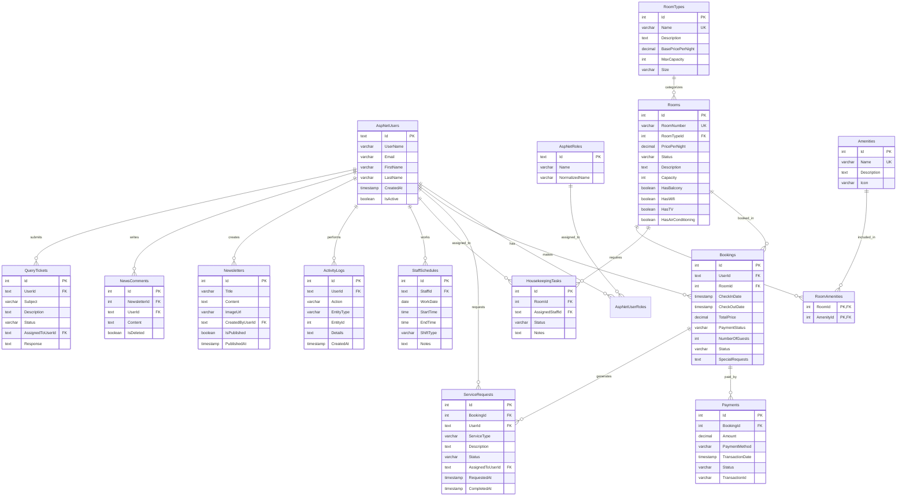

# Hotel Management System - Entity Relationship Diagram (ERD)

## Database Schema Overview

This document describes the Entity Relationship Diagram for the Hotel Management System database.

## Entity Relationship Diagram (Mermaid)

## Table Relationships

### Core Relationships

1. **Users & Roles** (Many-to-Many)
   - `AspNetUsers` ↔ `AspNetUserRoles` ↔ `AspNetRoles`
   - Users can have multiple roles (Admin, Manager, Housekeeping, Guest)

2. **Rooms & Room Types** (Many-to-One)
   - `Rooms` → `RoomTypes`
   - Each room belongs to one room type
   - Each room type can have multiple rooms

3. **Rooms & Amenities** (Many-to-Many)
   - `Rooms` ↔ `RoomAmenities` ↔ `Amenities`
   - Rooms can have multiple amenities
   - Amenities can be associated with multiple rooms

4. **Bookings & Users** (Many-to-One)
   - `Bookings` → `AspNetUsers`
   - Each booking belongs to one user (guest)
   - Users can have multiple bookings

5. **Bookings & Rooms** (Many-to-One)
   - `Bookings` → `Rooms`
   - Each booking is for one room
   - Rooms can have multiple bookings (over time)

6. **Payments & Bookings** (Many-to-One)
   - `Payments` → `Bookings`
   - Each payment is associated with one booking
   - Bookings can have multiple payments (partial payments, refunds)

7. **Housekeeping Tasks & Rooms** (Many-to-One)
   - `HousekeepingTasks` → `Rooms`
   - Each task is for one room
   - Rooms can have multiple tasks

8. **Housekeeping Tasks & Staff** (Many-to-One, Optional)
   - `HousekeepingTasks` → `AspNetUsers` (AssignedStaffId)
   - Tasks can be assigned to staff members
   - Staff can have multiple assigned tasks

9. **Service Requests & Bookings** (Many-to-One)
   - `ServiceRequests` → `Bookings`
   - Each service request is associated with one booking
   - Bookings can generate multiple service requests

10. **Service Requests & Users** (Many-to-One)
    - `ServiceRequests` → `AspNetUsers` (UserId - requester)
    - `ServiceRequests` → `AspNetUsers` (AssignedToUserId - assigned staff)

11. **Staff Schedules & Users** (Many-to-One)
    - `StaffSchedules` → `AspNetUsers`
    - Each schedule entry is for one staff member
    - Staff can have multiple schedule entries

## Key Constraints

- **Foreign Key Constraints**: All foreign keys are properly defined with appropriate ON DELETE behaviors
  - `RESTRICT`: Prevents deletion if related records exist (Bookings, Payments)
  - `SET NULL`: Allows deletion, sets foreign key to NULL (AssignedStaffId)
  - `CASCADE`: Deletes related records (NewsComments when Newsletter deleted)

- **Check Constraints**:
  - `Bookings`: CheckOutDate > CheckInDate
  - `Bookings`: NumberOfGuests > 0
  - `Payments`: Amount > 0
  - `StaffSchedules`: EndTime > StartTime

- **Unique Constraints**:
  - `Rooms.RoomNumber`: Unique room numbers
  - `RoomTypes.Name`: Unique room type names
  - `Amenities.Name`: Unique amenity names

## Indexes

All foreign keys and frequently queried columns have indexes for optimal performance:
- User lookups (Email, UserName)
- Room queries (RoomNumber, Status, RoomTypeId)
- Booking queries (UserId, RoomId, CheckInDate, CheckOutDate, Status)
- Payment queries (BookingId, Status)
- Housekeeping queries (RoomId, AssignedStaffId, Status)
- Service request queries (BookingId, UserId, Status)

